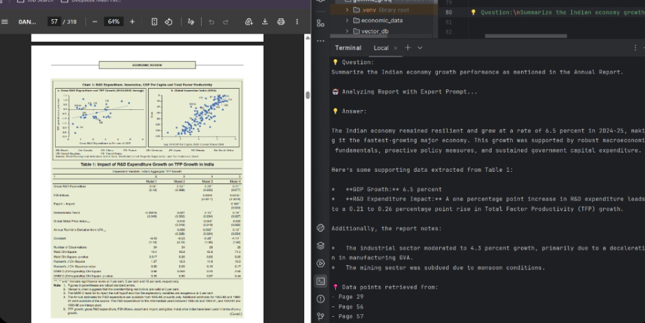

# Financial-RAG: Economic Report Analyzer
<p align="center">  <br>

*Intelligent retrieval and summarization of complex financial documents using local LLMs.*

---

An AI-powered terminal application designed to extract, synthesize, and analyze data from massive financial documents, such as the 300+ page Annual Economic Reports. This tool goes beyond simple keyword matching, using Retrieval-Augmented Generation (RAG) to understand context, interpret tables, and provide precise, cited answers to complex economic queries.

---

## 🛑 The Problem: Why `Ctrl+F` is Dead
Navigating dense, 320-page financial PDFs is a nightmare for analysts. Traditional `Ctrl+F` fails because:
* **It lacks context:** It finds words, not answers.
* **It ignores tables:** Extracting numerical data tied to specific metrics is manual and error-prone.
* **It can't synthesize:** You can't ask `Ctrl+F` to "Summarize the growth performance based on the revised estimates."

**The Solution:** A local, privacy-first RAG pipeline that reads the document, understands the query intent, retrieves the exact relevant chunks, and generates a coherent, data-backed answer with page citations.

---

## 🛠️ The Tech Stack
Built entirely with open-source and privacy-focused tools:
* **Framework:** [LangChain](https://python.langchain.com/) for orchestration and chunking (`RecursiveCharacterTextSplitter`).
* **Vector Database:** [ChromaDB](https://www.trychroma.com/) for fast, local semantic search using Max Marginal Relevance (MMR).
* **Local LLM & Embeddings:** [Ollama](https://ollama.com/) running `gemma3:4b` for generation and `nomic-embed-text` for creating embeddings. 
* **Document Processing:** `PyPDFLoader` for ingestion.

---

## 🚀 Getting Started

1. **Prerequisites**
   - Install [Ollama](https://ollama.com/) and pull the necessary models:
     ```bash
     ollama run gemma3:4b
     ollama pull nomic-embed-text
     ```
   - Python 3.8+ installed.

2. **Clone the Repository**
   ```bash
   git clone https://github.com/Xenaquas/Financial-RAG-Economic-Report-Analyzer.git
   cd Financial-RAG
   ```
3. **Install Dependencies**

   ```bash
    pip install langchain langchain-community langchain-chroma langchain-ollama pypdf chromadb
   ```

4. **Run the Analyzer**

- Place your target PDF in the economic_data/ directory.
- Execute the script:

  ```bash
    python demo.py
  ```

---

## 🔮 Future Scope
This terminal application is the foundation. Planned upgrades include:

- **Interactive UI:** Wrapping the logic in Streamlit or Gradio for a conversational web interface.
- **Multi-Document Support:** Analyzing and comparing multiple quarterly or annual reports simultaneously.
- **Advanced Table Extraction:** Integrating highly specialized parsers to better handle complex financial tables and nested data.
- **Agentic Capabilities:** Allowing the model to perform basic financial math (e.g., calculating YoY growth) on the retrieved data.

---

## 📬 Contact
Let's connect and talk about Data Science, AI, and building intelligent tools!

- Email: hmsk.tech@gmail.com
- GitHub: [Xenaquas](https://github.com/Xenaquas)
- LinkedIn: [Hamza Shaikh](www.linkedin.com/in/hamza-shaikh-ds)
